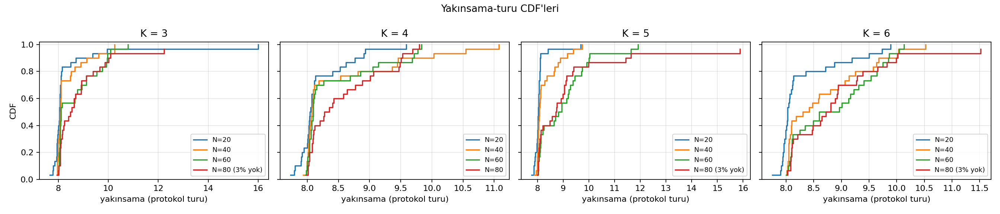
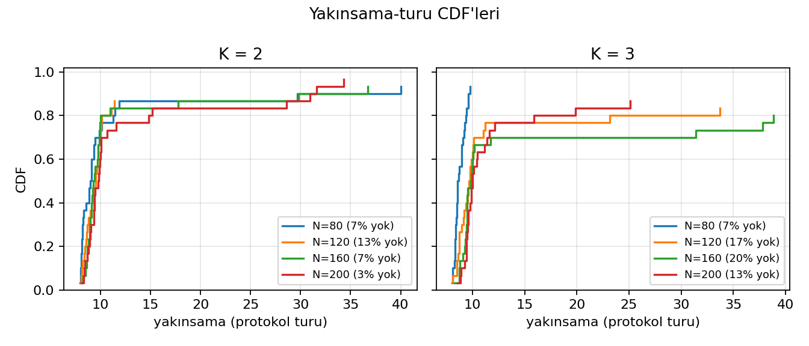
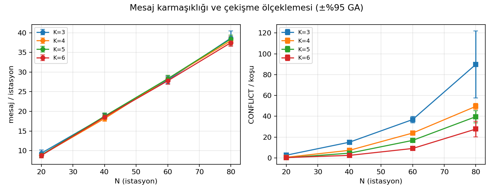
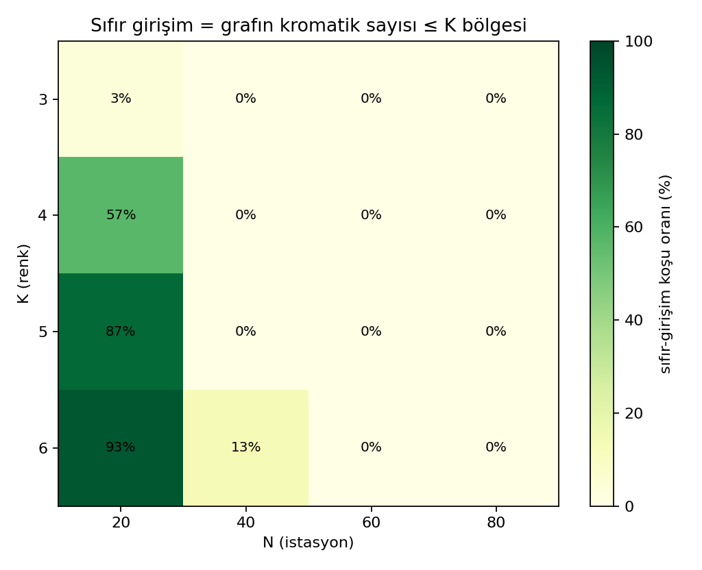

# AutoRes-HetNet

**Distributed PRB allocation for ultra-dense 5G networks via an asynchronous, message-passing Graph Coloring Game — implemented in Go.**

Each base station is an independent agent (a goroutine) that selects its own frequency block (PRB / "color") by exchanging real messages with its neighbors only. There is no central controller, no shared memory, and no synchronized rounds — agents race, collide, back off and retry, exactly like a real distributed protocol.

## The problem

In an ultra-dense network, nearby base stations sharing the same frequency block interfere with each other and throughput collapses. The classical fix is a centralized controller that sees the whole network and assigns frequencies — but it becomes a computational and latency bottleneck as the network densifies, and a single point of failure.

AutoRes-HetNet models the problem as a non-cooperative **Graph Coloring Game**: nodes = base stations, edges = interference relationships (weighted by path loss + log-normal shadowing), colors = orthogonal PRBs. Each agent repeatedly plays its **best response** (the color minimizing weighted conflict with its neighbors' last known colors) until the system settles into a Nash equilibrium.

## What is actually new here

The cell-as-player, color-as-frequency idea is well established in the potential-game literature. The contribution of this project is the **implementation and its empirical convergence analysis**:

- **Genuinely asynchronous and message-based.** Agents communicate through a 4-message protocol (`HELLO`, `PROPOSE`, `SUCCESS`, `CONFLICT`) over Go channels, with random start delays, message races, timeouts and queue drops — not the synchronous round-based or "one player moves at a time" abstraction most prior work assumes.
- **Contention resolution inside the protocol.** ID-priority plus random backoff (CSMA-like) resolves simultaneous proposals. A `CONFLICT` is *informational*: the receiver updates its view of the sender's color and withdraws only if its best response actually changes — if the contested color is still the minimum-cost choice (all colors occupied), the proposal stands. This is exactly best-response semantics and prevents the livelock where a station with no free color is vetoed forever.
- **End-to-end physical layer.** The color assignment is carried through a log-distance + log-normal shadowing channel to per-user downlink SINR, capped Shannon capacity, and Jain fairness — not just "conflict counts".

## Key empirical findings

All numbers below come from seeded Monte Carlo experiments with 95% confidence intervals (mean ± 1.96·σ/√n): the main table from 200 runs (`-runs 200 -optbudget 30s`, seed 42, N=40, K=5), the sweep from 30 runs per grid cell (`-sweep -runs 30 -timescale 0.1`).

**1. Convergence takes ~8–9 protocol rounds, nearly independent of density.** Across the K ∈ {3,4,5,6} × N ∈ {20,40,60,80} sweep, mean convergence time stayed within 8.1–9.0 think-periods while N quadrupled and the number of `CONFLICT` messages grew ~35× (2.6 → 89.8 at K=3). Mechanism: a contention loser backs off and re-proposes *within* the winners' commit-timeout window, so contention is absorbed by the pipeline instead of extending it. Two honest boundary signals: (a) rounds drift slightly upward with N (8.1 at N=20 → ~8.8–9.0 at N=80), and (b) at N=80 one run in thirty (3 of 480 total) failed to fully converge within the 40-round safety cap, stalling at 95–97.5% committed.


*Convergence-round CDFs (30 runs/cell): every curve rises steeply at 8–10 rounds regardless of N.*

**1b. Stress test: the constant is the *median*, and the failure mode is graceful.** Pushing into color-starved regimes (K ∈ {2,3}, N up to 200, 30 runs per cell: `-sweepK "2,3" -sweepN "80,120,160,200"`) quantifies the limit. *Median* convergence stays at ~9–10 rounds even at K=2, N=200 — where CONFLICT messages reach ~900 per run (~350× the sparse regime) — but a heavy straggler tail emerges: the 90th percentile stretches to 15–31 rounds, and 3–20% of runs per cell fail to fully converge within the 40-round cap. Crucially, every "failed" run stalls at **95–100% committed** — one or two stations cycling in contention — never a collapse; message cost stays exactly linear (~N/2 per station) and no queue ever overflowed. So the precise claim is: *bulk convergence is density-invariant up to at least N=200 and K=2; beyond N≈120 in color-starved regimes, tail latency degrades and full convergence within 40 rounds drops to 80–97%, with residual non-convergence confined to isolated stragglers.*


*Stress regime: the bulk still converges in ~9–10 rounds even at K=2, N=200; what degrades is the tail.*

**2. Message complexity is linear in density.** Messages per station grow ~9 → ~38 as N goes 20 → 80 (average degree grows linearly at fixed area). No queue drops were observed in any of the 480 sweep runs or the 200 main runs.


*Messages per station grow linearly with N; conflicts grow much faster yet do not extend median convergence.*

**3. Zero interference is a property of the graph, not of the algorithm.** Interference reaches exactly zero only when K ≥ the interference graph's chromatic number — in practice 57–93% of sparse runs (N=20, K ∈ {4,5,6}), 3% at K=3 even when sparse, and ~0% of dense runs (N≥40, except 13% at K=6). In dense regimes the algorithm *minimizes* interference; it cannot eliminate it. (An earlier version of this repository claimed unconditional zero interference from a single lucky run; that claim was wrong and is retracted.)


*Zero interference tracks the chromatic-number boundary of the interference graph, not the algorithm.*

**4. Near-centralized quality without a controller.** On identical frozen channel realizations (same user positions, same shadowing draws — so differences are attributable to the allocation alone), the distributed equilibrium is statistically indistinguishable from centralized greedy in throughput and fairness, and far above naive schemes. 200-run result (seed 42, capacity capped at 160 Mbps by the 8 bps/Hz spectral-efficiency ceiling):

| Scheme | Conflict cost | Mbps / served user | Jain |
|---|---|---|---|
| Distributed (NE) | 1.76e-09 ± 0.19e-09 | 131.0 ± 1.7 | 0.866 ± 0.009 |
| Centralized greedy | 1.35e-09 ± 0.15e-09 | 131.9 ± 1.7 | 0.871 ± 0.008 |
| DSATUR | 1.07e-09 ± 0.15e-09 | 137.1 ± 1.9 | 0.896 ± 0.009 |
| Fixed reuse (i mod K) | 6.34e-07 ± 4.5e-07 | 80.2 ± 1.4 | 0.616 ± 0.008 |
| Random | 1.36e-06 ± 1.7e-06 | 77.3 ± 1.5 | 0.599 ± 0.009 |

Reading: the distributed NE pays ~1.3–1.6× the conflict cost of the centralized heuristics (Gain over Greedy 1.52 ± 0.13) but converts that into essentially equal user throughput and fairness — with no controller, using only local messaging. Where the exact optimum was proven within budget (75/200 runs), the empirical PoA lower bound averaged 3.27 ± 0.61 (and in 6 runs OPT = 0 while the NE retained conflicts, i.e. PoA = ∞ on those instances — evidence that worst-case PoA of this game is unbounded even though *average* welfare loss is modest).

All runs converged (200/200) in 8.04 ± 0.03 rounds at the main configuration. Regenerate with `go run . -runs 200 -optbudget 30s` (topologies and channels are seed-reproducible; asynchronous message races are inherently not, which is part of what is being measured).

**5. Against a published distributed baseline (CFL), messaging buys robustness to color scarcity.** As a sixth scheme the repository implements Communication-Free Learning (Leith & Clifford 2006; convergence for graph coloring proven by Duffy, O'Connell & Sapozhnikov 2008): fully distributed, *zero messages*, learning only from a binary per-round conflict signal. Because CFL runs synchronously and uses no timers, its results are seed-exact and machine-independent. The comparison splits cleanly into two regimes:

| Regime | Ours (async, weighted, messaging) | CFL (sync, unweighted, silent) |
|---|---|---|
| Sparse, colors ample (N=20, K=6) | 100% conv., ~8.3 rounds | 100% conv., ~10.0 rounds |
| Sparse, colors tight (N=20, K=4) | 100% conv., ~8.2 rounds | 53% conv., ~56 rounds |
| Dense (N=40, K=4–6) | 100% conv., ~8.4–8.9 rounds | **0% conv.** (500-round cap) |

(30 runs/cell, seed 42.) The mechanism is structural, not a tuning artifact: CFL's stopping condition *is* a proper coloring, so when the interference graph's chromatic number exceeds K — the typical dense-HetNet case — CFL cannot terminate and wanders indefinitely; its last-iterate assignment then costs ~10³× more than the NE (1.7e-06 vs 1.7e-09 at the main configuration, where CFL converged in 2/60 runs). The weighted game, by contrast, has a well-defined answer (minimum-cost coloring) even when a conflict-free one does not exist. Where proper colorings are plentiful, CFL is honestly competitive — at similar round counts and with zero message overhead. That trade-off is the fairest one-line summary of what explicit messaging buys.

## Metrics: what they mean (and what they don't)

- **Gain over Greedy** — the ratio of the distributed solution's conflict cost to a centralized greedy heuristic's. This is **not** the Price of Anarchy: the denominator is a heuristic, not the optimum. An earlier version of this code mislabeled it as PoA; it has been renamed.
- **Empirical PoA lower bound** — the true social optimum is computed exactly by a branch-and-bound solver (`optimum.go`: connected-component decomposition, cost pruning, color-symmetry breaking, time budget). Since one run observes one Nash equilibrium (not the worst one), the ratio NE/OPT is reported as a *lower bound* on PoA, and only when optimality was proven within the time budget.
- **Jain fairness** — *descriptive only*. The algorithm does not optimize fairness; the index reflects the throughput distribution under stochastic user placement. Frozen-channel comparisons (above) are the meaningful way to compare fairness across schemes.

## Repository layout

| File | Contents |
|---|---|
| `types.go` | Types, protocol/PHY constants, scalable protocol timers, message counters |
| `basestation.go` | Agent lifecycle, best response, message handling, contention resolution |
| `physics.go` | Frozen-channel downlink SINR / capped Shannon capacity model |
| `metrics.go` | Jain index, global objective, greedy baseline wrapper |
| `baselines.go` | Greedy, DSATUR, fixed-reuse and random allocators (shared cost definition) |
| `cfl.go` | Published distributed baseline: Communication-Free Learning (Leith & Clifford) |
| `optimum.go` | Exact social optimum via branch-and-bound |
| `experiment.go` | Reproducible topology builder, logical-convergence runner, Monte Carlo core |
| `sweep.go` | K × N convergence sweep with CSV export |
| `main.go` | CLI entry point and single-run (educational) mode |
| `plot_sweep.py` | Convergence CDFs, scaling plots, zero-interference heatmap (matplotlib only) |
| `*_test.go` | Unit tests incl. analytic PHY checks and B&B-vs-exhaustive validation |

## Quick start

```bash
go test ./...                      # run the test suite

go run . -runs 1 -v                # single detailed run with agent logs + viz_data.json
go run .                           # Monte Carlo, 100 runs, mean ± 95% CI + baseline table
go run . -runs 200 -optbudget 30s  # paper-grade main table (~20 min)

# Convergence sweep (10x accelerated timers), then figures:
go run . -sweep -runs 30 -timescale 0.1
python plot_sweep.py sweep_results.csv sweep
```

| Flag | Default | Meaning |
|---|---|---|
| `-runs` | 100 | Monte Carlo runs (1 = detailed single run); in sweep mode: runs per grid cell |
| `-seed` | 42 | Base seed; run *r* uses seed + *r* (reproducible topologies/channels) |
| `-sweep` | false | Run the K × N convergence sweep |
| `-sweepK`, `-sweepN` | `3,4,5,6` / `20,40,60,80` | Sweep grid (comma-separated) |
| `-timescale` | 1.0 | Scales all protocol timers proportionally (0.1 = 10× faster; ratios preserved) |
| `-optbudget` | 3s | Time budget per run for the exact-optimum solver |
| `-csv` | `sweep_results.csv` | Sweep raw-data output (per-run rows; CDFs are plotted from this) |
| `-v` | false | Agent-level logging (single-run mode only) |

## Methodology notes

- **Logical convergence, not wall clock.** A run ends when every station reaches `COMMITTED` (with a safety cap), and convergence time is reported in protocol rounds (think-periods) — a timescale-invariant unit.
- **Frozen channels.** All allocation schemes in a run are evaluated on one channel realization (user positions + all shadowing draws), isolating the allocation effect from placement luck.
- **Physical model.** Downlink SINR at the user position; interference from actually-transmitting (committed) co-channel neighbors over the true interferer→UE geometry; shadowing on serving and interfering links symmetrically; SINR ≤ 30 dB and spectral efficiency ≤ 8 bps/Hz caps.
- **Simulation parameters** (single source of truth in `types.go`): N=40, area 400×400 m, neighbor threshold 100 m, K=5, Ptx=40 W, B=20 MHz, α=3.0, log-normal shadowing.

## Limitations and future work

No theoretical convergence guarantee is claimed for the asynchronous setting (interference games are not always exact potential games); convergence is demonstrated empirically. The topology is static (no mobility, no arrivals/departures). The constant-round finding was stress-tested to N=200 / K=2 (finding 1b): the median is density-invariant but the tail is not, so any scaling-law statement must be phrased in terms of median/bulk convergence. Straggler resolution (e.g. a priority-aging rule for stations that lose repeatedly) is an open protocol improvement. Fairness is not an optimization target; adding a fairness term to the utility is future work, as is comparing against learning-based (e.g., MARL) allocators.

## Selected references

R. W. Rosenthal, *A class of games possessing pure-strategy Nash equilibria*, Int. J. Game Theory, 1973 · D. Monderer, L. S. Shapley, *Potential games*, GEB, 1996 · P. N. Panagopoulou, P. G. Spirakis, *A game theoretic approach for efficient graph coloring*, ISAAC 2008 · K. Cohen, A. Leshem, E. Zehavi, *Convergence of approximate best-response dynamics in interference games* · D. J. Leith, P. Clifford, *A self-managed distributed channel selection algorithm for WLAN*, RAWNET/WiOpt, 2006 · K. R. Duffy, N. O'Connell, A. Sapozhnikov, *Complexity analysis of a decentralised graph colouring algorithm*, Inf. Process. Lett., 2008.
